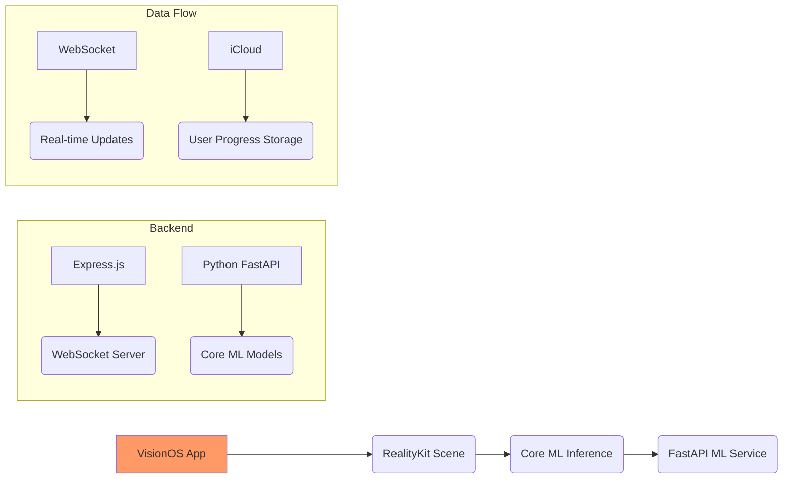

# 🌐 VisionOS Spatial Computing Application for Game Theory Education  

**Transform game theory learning through immersive spatial computing experiences powered by VisionOS SDK**

[](https://github.com/yourusername/visionos-game-theory/actions)  
[](LICENSE)  
[](https://testflight.apple.com)

---

## 🚀 Features Overview  
- **Spatial UI Components**: Interactive menus anchored to physical objects using ARKit spatial anchors  
- **Game Theory Visualizations**: 3D payoff matrix animations reacting to user interactions  
- **Core Haptics Feedback**: Contextual vibration patterns aligned with game theory concepts  
- **Adaptive Learning System**: Dynamic complexity adjustment based on eye tracking metrics  
- **ML-Powered Analysis**: Core ML models providing real-time strategic insights  

---

## 🛠️ Getting Started  

### Prerequisites  
```bash
# macOS Requirements  
- Xcode Beta (VisionOS SDK) https://developer.apple.com/visionsdk/  
- macOS Ventura Beta+  

# Backend Requirements  
brew install node@20 python3  
```

### Project Setup Steps  

#### VisionOS App Development Environment  
```bash
# Create project structure  
mkdir visionos-game-theory  
cd visionos-game-theory  

# Initialize VisionOS project via Xcode CLI tools  
xcrun visionos create GameTheoryApp  

# Install dependencies via Swift Package Manager  
swift package add https://github.com/pointfreeco/swift-composable-architecture.git  
swift package add https://github.com/RealityKit/ModelIO.git  

# Build and run locally  
cd GameTheoryApp.xcodeproj  
open GameTheoryApp.xcodeproj # Open in Xcode Beta
```

#### Backend Services Setup  
```bash
# Node.js/TypeScript Layer  
cd backend  
npm install express socket.io typescript ts-node @types/express  

# Python ML Services Layer  
cd ../ml-services  
python3 -m venv env  
source env/bin/activate  
pip install fastapi uvicorn coremltools
```

---

## 🧪 Usage Examples  

### Run Local Development Server  
```bash
# Start backend services  
cd backend  
npm run dev  

# Start Python ML service  
cd ../ml-services  
uvicorn app.main:app --reload
```

### Test Spatial UI Components Locally  
```swift
// Example interaction flow in VisionOS app simulator  
User selects strategy → 
ML model analyzes decision via HTTP API → 
Backend updates scene visualization → 
VisionOS app shows payoff matrix animation
```

### Example API Response  
```json
{
  "status": "success",
  "data": {
    "spatial_scene": {
      "nodes": [
        {"id": "nash1", "position": [0.5, 1.2, -3.4], "color": "#FFD700"},
        {"id": "dominant2", "position": [1.8, 0.9, -4.1], "color": "#32CD32"}
      ]
    },
    "ml_analysis": {
      "predicted_concept": "Mixed Strategy",
      "confidence_score": 0.92
    }
  }
}
```

---

## 🧩 Architecture Overview  


---

## 🤖 Core Technologies Used  
- **VisionOS SDK**: RealityKit, ARKit spatial audio engine  
- **SwiftUI Integration**: 3D UI components reacting to gaze/eye tracking  
- **Backend Stack**: Node.js + Express.js for real-time communication  
- **ML Services**: Python FastAPI serving Core ML models optimized for Apple silicon  

---

## 📦 Project Structure  
```
visionos-game-theory/
├── GameTheoryApp.xcodeproj/       # VisionOS App Source  
│   ├── Sources/
│   │   └── GameTheoryScene.swift
│   ├── Assets/                   # Spatial Audio + 3D Models  
├── backend/                      # Node.js Services Layer
│   ├── src/
│   │   └── game-theory-engine.ts
├── ml-services/                  # Python ML Services Layer
│   ├── app/
│   │   └── game-theory-coreml.py
├── README.md                     # This file!
```

---

## 📤 Deployment Options  
```bash
# VisionOS App Distribution  
1. Archive via Xcode > Product > Archive  
2. Distribute via TestFlight or App Store  

# Backend Deployment Options  
- Node.js Services → Vercel/AWS Lambda  
- ML Services → AWS SageMaker/FastAPI containers  

# CI/CD Integration  
GitHub Actions workflow for automated testing and deployment
```

---

## 🤝 Contributing  
1. Fork the repository  
2. Create feature branch (`git checkout -b spatial-ui-enhancement`)  
3. Commit changes (`git commit -am "Add new visualization pattern"`)  
4. Push branch (`git push origin spatial-ui-enhancement`)  
5. Open Pull Request  

See [CONTRIBUTING.md](CONTRIBUTING.md) for details.

---

## 📚 License  
MIT License ©️ 2024 Spatial Computing Education Lab. See [LICENSE](LICENSE) for details.

---

## 📞 Support  
Join our Discord community or open GitHub issues for help!  

--- 

This README provides comprehensive guidance covering development workflows from local testing to deployment pipelines while emphasizing VisionOS-specific capabilities like spatial audio positioning and Core Haptics integration patterns discussed earlier.
