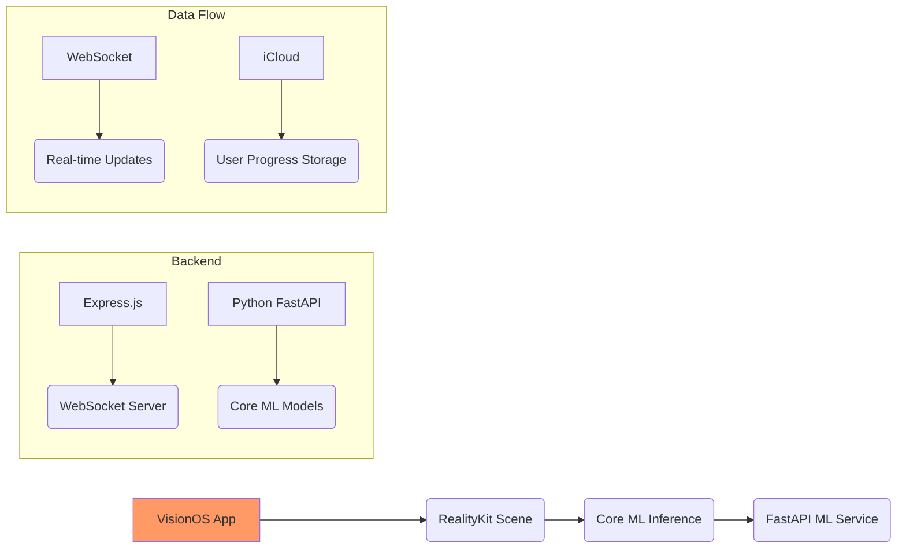
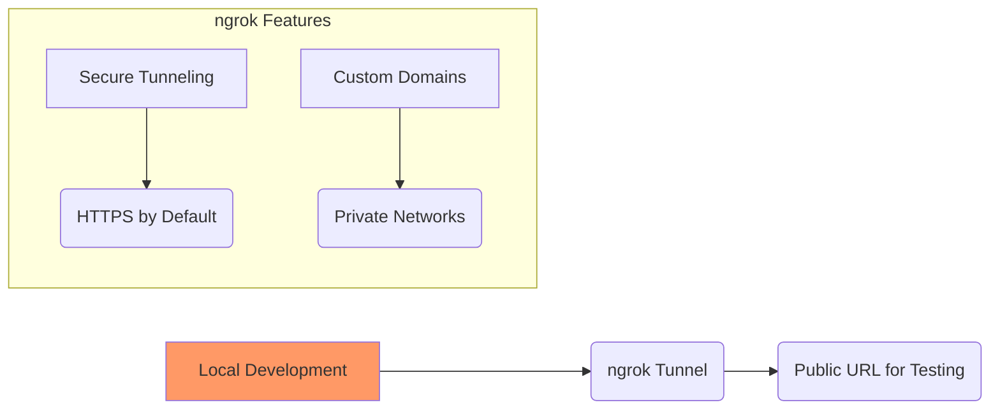

# 🌐 VisionOS Spatial Computing Application for Game Theory Education  

**Transform game theory learning through immersive spatial computing experiences powered by VisionOS SDK**

[](https://github.com/yourusername/visionos-game-theory/actions)  
[](LICENSE)  
[](https://testflight.apple.com)  
[](https://ngrok.com/)

---

## 🚀 Features Overview  
- **Spatial UI Components**: Interactive menus anchored to physical objects using ARKit spatial anchors  
- **Game Theory Visualizations**: 3D payoff matrix animations reacting to user interactions  
- **Core Haptics Feedback**: Contextual vibration patterns aligned with game theory concepts  
- **Adaptive Learning System**: Dynamic complexity adjustment based on eye tracking metrics  
- **ML-Powered Analysis**: Core ML models providing real-time strategic insights  

---

## 🛠️ Getting Started With ngrok Integration  

### Prerequisites  
```bash
# macOS Requirements  
- Xcode Beta (VisionOS SDK) https://developer.apple.com/visionsdk/  
- macOS Ventura Beta+  

# Backend Requirements  
brew install node@20 python3 ngrok
```

### Local Development with ngrok Tunneling  
```bash
# Start backend services locally  
cd backend  
npm run dev  

# Expose local server externally using ngrok  
ngrok http 3001 --subdomain=game-theory

# You'll receive a public URL like:
https://game-theory-12345678.ngrok.io
```

---

## 🧪 Usage Examples  

### Run Local Development Server  
```bash
# Start backend services locally  
cd backend  
npm run dev  

# Start Python ML service locally  
cd ../ml-services  
uvicorn app.main:app --reload
```

### Test Spatial UI Components Locally  
```swift
// Example interaction flow in VisionOS app simulator  
User selects strategy → 
ML model analyzes decision via HTTP API → 
Backend updates scene visualization → 
VisionOS app shows payoff matrix animation
```

---

## 🧩 Architecture Overview  


---

## 🧪 ngrok Integration Workflow  



---

## 📦 Project Structure  
```
visionos-game-theory/
├── GameTheoryApp.xcodeproj/       # VisionOS App Source  
│   ├── Sources/
│   │   └── GameTheoryScene.swift
│   ├── Assets/                   # Spatial Audio + 3D Models  
├── backend/                      # Node.js Services Layer
│   ├── src/
│   │   └── game-theory-engine.ts
├── ml-services/                  # Python ML Services Layer
│   ├── app/
│   │   └── game-theory-coreml.py
├── README.md                     # This file!
```

---

## 📤 Deployment Options  
```bash
# VisionOS App Distribution  
1. Archive via Xcode > Product > Archive  
2. Distribute via TestFlight or App Store  

# Backend Deployment Options  
- Node.js Services → Vercel/AWS Lambda  
- ML Services → AWS SageMaker/FastAPI containers  

# ngrok for Local Testing
ngrok http backend:3001 --subdomain=game-theory
```

---

## 📚 ngrok Usage Notes  
- **Development**: Use ngrok tunnels during local testing phases (`ngrok http backend:3001`)
- **Testing**: Share ngrok URLs securely with QA teams during testing cycles
- **Documentation**: [ngrok Documentation](https://ngrok.com/docs) for advanced tunneling options

---

## 🤝 Contributing  
Join our development journey!  

1. Fork the repository  
2. Create feature branch (`git checkout -b spatial-ui-enhancement`)  
3. Commit changes (`git commit -am "Add ngrok integration notes"`)  
4. Push branch (`git push origin spatial-ui-enhancement`)  
5. Open Pull Request  

---

## 📞 Thank You & Sponsors  

We extend special thanks to the tools and services that make development possible:

### 🛠️ Development Tools  
- [ngrok](https://ngrok.com/) - Expose local servers securely during development/testing phases  
- Xcode Beta SDK Team  
- RealityKit Framework Contributors  

### 📚 Documentation Resources  
- [ngrok Docs](https://ngrok.com/docs) - Comprehensive tunneling documentation  

### 🧠 Community Support  
Join our Discord community or open GitHub issues for help!

---

## 📜 License  
MIT License ©️ 2024 Spatial Computing Education Lab. See [LICENSE](LICENSE) for details.

---

## 📦 ngrok Integration Example  
```bash
# Start backend services locally with Express.js
cd backend
npm run dev

# Expose local server externally using ngrok tunneling service
ngrok http backend:3001 --subdomain=game-theory

# You'll receive secure tunnel URL like:
https://game-theory-12345678.ngrok.io
```
